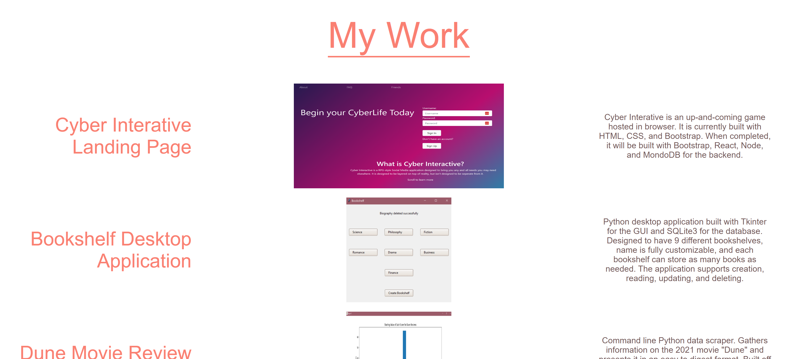
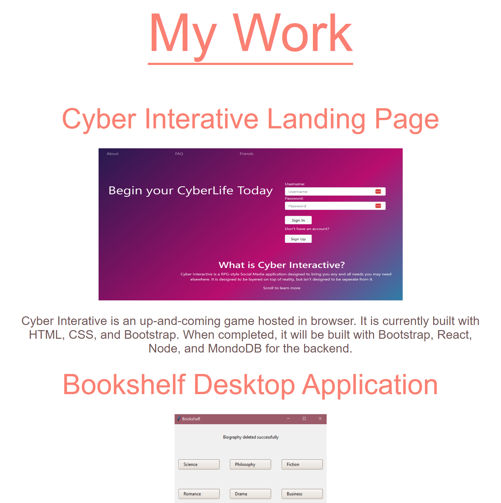

# PersonalPortfolio

Author: Ehren Lewis

My personal portfolio website to showcase my own development process
as I learn more about software development.

I used only html and css to create the site
.
Some of the challenges I faced while working on this project
was the color theory of it, I had trouble finding good colors
that went together. Some of the other challenges I faced
were in the my work section of the portfolio, I tried
adding rows with pure flex container and ran into some issues,
so I decided to switch to a grid system to allow for easier 
responisiveness. I then ran into the issue of not being able to add
a border to the bottom of each row due to column spacing being around
the children and not the column itself, so I had to reformat
the my work section to make sure there was concise connectedness
between the title, image, and description.

Known issues: 
The biggest issue is when learning the MERN stack, I don't have any web applications deployed,
two of the projects are built out of python and are command line, and one is a landing page that is only
html, css, and bootstrap. The current software development skills I have do not line up with my future career path.

The form doesn't have any javascript elements, submitting form detail
won't do anything besides redirect to another page, which will be setup down the line.
This does also create the issue. For using github pages, the connection is secure, but
having the form could be an issue down the line if the connection is HTTP instead of HTTPS

# How to Install

1. Navigate to the code repository
2. Press the green code button, located near the about section
3. Copy either the HTTPS, Git CLI, download the zip, open with GitHub desktop, or copy the SSH link.
4. Depending on download method, use Git, executable, or the desktop application to open the content files
5. All of the content of the repository will be available after completion of the previous state.

# OR

1. Visit the live site
2. Copy the files from the developer tools into your own files

link to live site: https://ehren-lewis.github.io/PersonalPortfolio/
link to repository: https://github.com/Ehren-Lewis/PersonalPortfolio

# Usage

The user can use this project for viewing my personal development work,
as well as testing my ability to program responsively, using flex and grid containers,
images that are links, as well as styling

